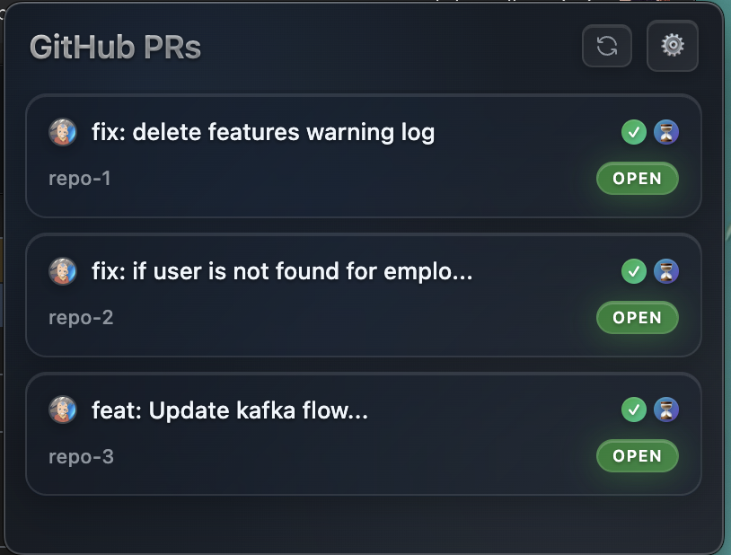

# GitHub PR Widget

A sleek, floating Electron app that displays your GitHub pull requests with real-time status indicators in a beautiful, always-on-top window.



## ✨ Features

### 🪟 **Beautiful UI**
- **Floating Window**: Always-on-top, resizable window with glassy design
- **Frameless Design**: Seamless look without title bar
- **Dark Theme**: Modern gradient backgrounds with blur effects
- **Drag & Drop**: Move window by dragging the header area

### 📊 **Smart Status Indicators**
- **CI Status**: Real-time check status (✓ passed, ✗ failed, ⏳ pending, ? unknown)
- **Review Status**: Approval tracking (✓ approved, ✗ changes requested, ⏳ pending, ? unknown)
- **Instant Tooltips**: Detailed explanations on hover with glassy styling
- **Color-coded**: Visual status indicators with gradient backgrounds

### 🔄 **Auto-refresh & Updates**
- **Auto-refresh**: Updates every 10 minutes automatically
- **Manual refresh**: Click the refresh button for instant updates
- **Live data**: Fetches latest PR data, CI checks, and review status

### 🎯 **User Experience**
- **Clickable PRs**: PR titles open in your default browser
- **Responsive**: Scrollable list that adapts to window size
- **Settings Dialog**: Easy GitHub token configuration
- **Keyboard shortcuts**: Developer tools and app controls

### ⚙️ **Configuration**
- **Settings Window**: Built-in settings dialog for GitHub token setup
- **Token validation**: Automatic token validation and error handling
- **Secure storage**: Encrypted token storage using electron-store

## 🚀 Quick Start

### Build from Source

1. **Clone the repository**:
   ```bash
   git clone https://github.com/blakehaddad/github-pr-widget.git
   cd github-pr-widget
   ```

2. **Install dependencies**:
   ```bash
   npm install
   ```

3. **Build and run**:
   ```bash
   npm run build
   npm start
   ```

4. **Configure GitHub token**: Click the settings button (⚙️) in the app and enter your token

## 🔧 Build and Installation Guide (macOS)

### Prerequisites
- **Node.js** (v16 or higher) - [Download here](https://nodejs.org/)
- **npm** (comes with Node.js)
- **Xcode Command Line Tools** (for macOS builds):
  ```bash
  xcode-select --install
  ```

### Step-by-Step Build Process

1. **Prepare the environment**:
   ```bash
   # Clone the repository
   git clone https://github.com/blakehaddad/github-pr-widget.git
   cd github-pr-widget
   
   # Install dependencies
   npm install
   ```

2. **Build the application**:
   ```bash
   # Compile TypeScript to JavaScript
   npm run build
   
   # Test the app locally
   npm start
   ```

3. **Create a distributable package**:
   ```bash
   # Build macOS .dmg installer
   npm run dist:mac
   
   # Or build for all platforms
   npm run dist
   ```

4. **Install the built app**:
   ```bash
   # The built .dmg file will be in the dist/ folder
   # Double-click the .dmg file and drag to Applications
   open dist/GitHub\ PR\ Widget-*.dmg
   ```

### Build Output Locations
- **Development build**: `dist/` folder (JavaScript files)
- **App bundle**: `dist/mac/GitHub PR Widget.app`
- **Installer**: `dist/GitHub PR Widget-*.dmg`
- **Unpacked app**: `dist/mac-unpacked/`

## 🎮 Usage

1. **First Launch**: The app will prompt you to configure your GitHub token
2. **Settings**: Click the settings button (⚙️) to open the configuration dialog
3. **GitHub Token**: Create a Personal Access Token at [GitHub Settings](https://github.com/settings/tokens)
4. **Token Permissions**: The token needs `repo` scope to read private repositories, or `public_repo` for public repositories only
5. **Refresh**: Use the refresh button (🔄) or wait for auto-refresh every 10 minutes

## 📋 Available Scripts

- `npm run build` - Compile TypeScript to JavaScript
- `npm start` - Build and run the app
- `npm run dev` - Build and run in development mode
- `npm run pack` - Build unpacked app for testing
- `npm run dist` - Build distributable for all platforms
- `npm run dist:mac` - Build macOS `.dmg` installer
- `npm run dist:win` - Build Windows `.exe` installer
- `npm run dist:linux` - Build Linux AppImage

## ⌨️ Keyboard Shortcuts

- **F12** / **Cmd+Option+I** / **Ctrl+Shift+I** - Toggle developer tools
- **Cmd+Q** (Mac) / **Alt+F4** (Windows/Linux) - Quit app
- **Cmd+,** (Mac) / **Ctrl+,** (Windows/Linux) - Open settings

## 🔐 GitHub Token Setup

1. Go to [GitHub Settings > Developer settings > Personal access tokens](https://github.com/settings/tokens)
2. Click "Generate new token (classic)"
3. Select the following scopes:
   - `repo` (for private repositories)
   - `public_repo` (for public repositories only)
4. Copy the generated token
5. Open the app settings (⚙️) and paste the token

## 🛠️ Tech Stack

- **Electron** - Desktop app framework
- **TypeScript** - Type-safe JavaScript
- **GitHub REST API** - Fetch pull request data
- **GitHub Checks API** - CI status monitoring
- **GitHub Reviews API** - Review approval tracking
- **electron-store** - Encrypted settings storage
- **Plain JavaScript + DOM** - No frontend framework dependencies

## 📁 Project Structure

```
src/
├── main.ts              # Electron main process
├── renderer.html         # UI structure and styling
├── renderer.ts          # GitHub API integration and UI logic
├── settings.html        # Settings dialog UI
├── settings.ts          # Settings management
└── assets/
    └── icons/
        └── refresh.svg   # Custom refresh icon
```

## 🚀 Releases

Automated releases are created via GitHub Actions when you push a git tag:

```bash
git tag v1.0.0
git push origin v1.0.0
```

This will automatically:
- Build the app for macOS, Windows, and Linux
- Create a GitHub release with downloadable installers
- Generate release notes from commit messages

## 🔍 Status Indicators

The app displays two types of status indicators for each PR:

### CI Status (Left indicator)
- **✓ Green**: All CI checks passed
- **✗ Red**: Some CI checks failed
- **⏳ Yellow**: CI checks are still running
- **? Gray**: No CI configured or status unknown

### Review Status (Right indicator)
- **✓ Green**: PR has been approved by reviewer(s)
- **✗ Red**: Changes have been requested
- **⏳ Blue**: Waiting for review
- **? Gray**: No review activity

## 🎨 Design Philosophy

The app embraces a **glassy, modern aesthetic** with:
- Gradient backgrounds throughout the interface
- Backdrop blur effects for depth
- Subtle shadows and highlights
- Consistent color scheme matching GitHub's design language
- Smooth animations and transitions

## 🐛 Troubleshooting

### Common Issues

1. **"No GitHub token configured"**: Open settings (⚙️) and add your Personal Access Token
2. **Empty PR list**: Ensure your token has correct permissions and you have open PRs
3. **Status indicators not showing**: Check your token has access to the repository's CI/review data
4. **App won't start**: Try rebuilding with `npm run build` and `npm start`

### Debug Mode

Enable developer tools with **F12** or **Cmd+Option+I** to inspect logs and debug issues.

## 📄 License

This project is licensed under the ISC License. See the [LICENSE](LICENSE) file for details.

## 🤝 Contributing

Contributions are welcome! Please feel free to submit a Pull Request.

## 📞 Support

If you encounter issues or have questions, please [open an issue](https://github.com/blakehaddad/github-pr-widget/issues) on GitHub.